```{r render, include = FALSE, eval = FALSE}
pandoc::pandoc_activate(version = "3.1.6")
rmarkdown::render("RJournal/DrivePlotR.Rmd", output_format = "all")
```

```{r setup, include=FALSE}
knitr::opts_chunk$set(echo = FALSE, warning = FALSE, message = FALSE, out.width = "100%")
library(DrivePlotR)
library(tidyverse)
library(gpsdriving)
library(sf)
library(crosstalk)
options(tinytex.verbose = TRUE)
```

# Introduction

Vehicle trajectory data are a type of multivariate high-resolution spatio-temporal data that represent an essential data source for intelligent transportation systems. Such trajectory data have many applications, including traffic management and safety. Connected vehicle (CV) data are one source of vehicle trajectory data. These data are obtainable from third-party vendors who collaborate with vehicle original equipment manufacturers (OEMs) to ensure that the vehicles incorporate the necessary technology for data collection. In CV data, a vehicle trajectory consists of all recorded observations during a single drive from when the vehicle is turned on to when the vehicle is turned off. Observations are typically taken every few seconds. In addition to the vehicle's geographical position in latitude and longitude, CV data records generally include the time stamp, the current speed, and the vehicle's heading (direction) in $[0, 360)$ degrees with true north at 0 degrees and increasing clockwise. An (anonymous) identifier connects observations for the same vehicle to its trajectory. Complete spatio-temporal trajectories for individual vehicles may therefore be found by grouping the observations by trajectory identifier and then sorting by time. CV data are used in a variety of applications, including evaluating traffic signal performance [@saldivar-carranzaNextGenerationTraffic2023], monitoring delays at land border crossings between the United States and Mexico [@sakhareMethodologyMonitoringBorder2024], and detecting freeway crashes in real time [@kandiboinaRealTimeFreewayCrash2024].

Naturalistic driving studies (NDS) are another source of multivariate high-resolution spatio-temporal driving data. For example, consider the NDS administered by the Transportation Research Board of the National Academies as part of the Second Strategic Highway Research Program (SHRP 2). The SHRP 2 NDS aimed to understand the effect of driver performance and behavior on traffic safety. For the SHRP 2 NDS, volunteers from six different US states consented to have a data acquisition system (DAS) installed in their vehicles to monitor and record their driving behavior during the study period. The DAS involved multiple data collection channels, including video cameras, GPS (Global Positioning System) receivers, and accelerometers. The telematics data collected in the SHRP 2 NDS include many of the same variables collected in CV data [@campbellSHRP2Naturalistic2012]. @hallmarkEvaluationDrivingBehavior2015 used SHRP 2 NDS data to evaluate drivers' behavior on curves in rural 2-lane roads and assess the risk of drivers departing the roadway under different conditions. In the years since SHRP 2, other naturalistic driving studies have been conducted using more advanced data collection technology.
@basulto-eliasStrategySafetyStop2023 used data collected during a recent NDS conducted by the University of Nebraska Medical Center to evaluate the scanning and stopping behaviors of older drivers at stop-controlled intersections. 

Regardless of source, vehicle trajectory data are complex, with spatio-temporal and multivariate aspects. This complexity presents a particular set of challenges in data visualization, which is an essential step in any preliminary data analysis. Ideally, analysts would like to visualize and review both the spatio-temporal and multivariate elements of the data simultaneously. The process for doing so is not always straightforward.

Many tools are available to create interactive maps and plots. For example, ArcGIS Pro is a widely used, powerful tool for mapping spatial data. However, linking between multiple plots is not possible within ArcGIS Pro. The software Tableau, on the other hand, is a popular tool known for creating interactive visualizations and dashboards, and it is possible to use Tableau to create interactive visualizations similar to those introduced by \pkg{DrivePlotR}. However, both ArcGIS Pro and Tableau are proprietary software, with a cost that provides a barrier for some analysts. Additionally, modifications to an existing Tableau dashboard, such as creating new variables and including them in the visualizations, are, at best, inconvenient and, at worst, impossible.

A large motivation for creating \pkg{DrivePlotR} was the possibility of easily sharing visualizations with collaborators. For example, given the sensitive nature of data from a naturalistic driving study, analysts are under strict requirements from the ethics board to preserve the privacy of participants. Tableau visualizations typically need to be shared within a Tableau user group or hosted publicly. Thus, it is difficult to share Tableau visualizations with external collaborators while still maintaining a degree of privacy. Please note that the data used in all of the visualizations shown in this article are not sensitive in nature and can be freely shared.

This article discusses \pkg{DrivePlotR}, an open-source dashboard for visualizing multivariate high resolution spatio-temporal data in linked plots. Figure \@ref(fig:teaser) shows a first example of using \pkg{DrivePlotR} to display DAS-captured data. \pkg{DrivePlotR} visualizations consist of a dashboard containing a map and corresponding time-series charts showing additional measurements. While Figure \@ref(fig:teaser) is a static screenshot, \pkg{DrivePlotR} is an interactive web-app that allows the users to interact with each of the visuals. Additionally, the plots are connected to each other via linked highlighting. This allows analysts to visualize both aspects of geospatial and temporal measurements in low-dimensional displays and render their multivariate relationships [@willsLinkedDataViews2008]. 

```{r teaser, fig.cap = "A screenshot of an interactive plot map created with DrivePlotR rendered as an HTML file in an internet browser."}
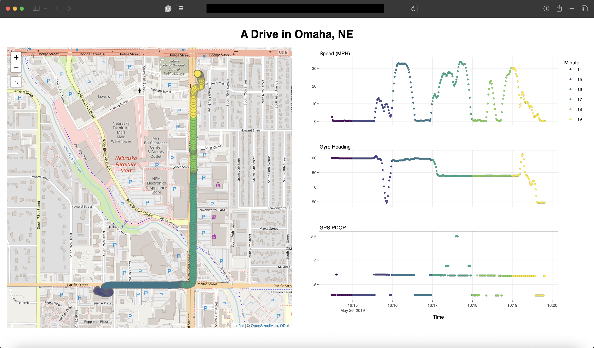
```

A more detailed description of \pkg{DrivePlotR} and a discussion of all the components in Figure \@ref(fig:teaser) are provided. Then, some use cases of \pkg{DrivePlotR} are highlighted and the \pkg{DrivePlotR} workflow is demonstrated. Lastly, possible extensions for future versions of \pkg{DrivePlotR} are discussed.

# The DrivePlotR App 

\@ref(fig:teaser) provides an example of a visualization created with the `driveplot()` function from \pkg{DrivePlotR}. The left-hand side of Figure \@ref(fig:teaser) lays out the trajectory of a drive in Omaha, Nebraska, USA, that occurred on May 26, 2019. Each point represents the vehicle's geospatial location for each second of the drive. The colors on the map (and the corresponding colors on the graphs on the right-hand side) denote each minute of the drive, allowing viewers to gain a better understanding of the drive's temporal component and the direction in which the drive was taken.

The three stacked graphs on the right-hand side of Figure \@ref(fig:teaser) show three time series with data related to the drive. From top to bottom, the stacked graphs display the vehicle's current speed (miles per hour), its direction (heading) in degrees, and GPS PDOP. PDOP stands for \underline{p}osition \underline{d}ilution \underline{o}f \underline{p}recision. DOP values capture the relative positions of the GPS satellites and give an indication of the quality of the GPS data for each second. DOP is a variance measure, and therefore a lower DOP coefficient indicates better GPS data quality. DOP coefficient values of 5 and below are considered good enough for most applications involving navigation in an urban environment [@isikIntegrityAnalysisGPSBased2020]. In the example of the drive shown in Figure \@ref(fig:teaser), the PDOP values are all well below 3, indicating that the GPS data are likely of adequate quality. However, GPS data should be approached cautiously, as even data with low PDOP may still show anomalies. This will be discussed later.

The interface of \pkg{DrivePlotR} visualizations consists of four components: (1) a map, (2) companion graph(s), (3) the infrastructure linking the visuals and enabling the interactivity, and (4) the non-standard evaluation used within the package functions. Users can see the first two components (map and companion graph) through the interactive plot maps produced by \pkg{DrivePlotR}. The third and fourth components (infrastructure and non-standard evaluation) exist within the \pkg{DrivePlotR} codebase. Although invisible to the user, the infrastructure is the key component that controls the linked interactive plot maps produced by \pkg{DrivePlotR}. Therefore, that infrastructure is described first, followed by a discussion of the non-standard evaluation used within \pkg{DrivePlotR}. Then, we discuss the creation of the map and the companion graph(s) in \pkg{DrivePlotR} plot maps.

## Infrastructure and Code

### Data Format

Datasets used in \pkg{DrivePlotR} are assumed to have one row for each observation. For example, if the data source is a DAS installed in a vehicle that records data every second, each row in the dataset represents one second during the drive. For each observation, the GPS coordinates (longitude and latitude in decimal degrees) are available, along with other information such as the vehicle's speed, heading, acceleration, etc. \pkg{DrivePlotR} accepts datasets with explicit longitude and latitude columns (that must be specified by the user) as well as datasets with a simple features geometry column, such as datasets in the format from \CRANpkg{sf} [@pebesmaSpatialDataScience2023]. If a simple features geometry column is present in the data, \pkg{DrivePlotR} assumes that the geometry type for the column is POINT because each row represents a single point in time and space. Other geometry types are incompatible with \pkg{DrivePlotR} plot maps and will cause errors.

The \CRANpkg{crosstalk} package [@chengCrosstalkInterWidgetInteractivity2023] is the key to the interactivity of \pkg{DrivePlotR} visualizations. Before creating any \pkg{DrivePlotR} visualizations, the data to be visualized must first be converted into a shared data frame, which is an R6 class created using the `SharedData$new()` method from \CRANpkg{crosstalk}. 

```{r shared-data, fig.cap = "Sketch of the chain of reactive events triggered by (1) the user selecting a point on the map."}
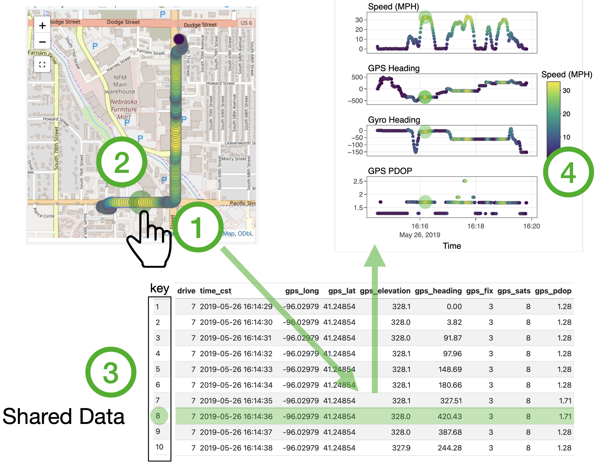
```

`SharedData` objects are augmented data frames, with explicit key variables (here, an ID for each observation) and a list of all objects that use the data. 
Together, these augmentations facilitate linked highlighting by communicating the selection state and changes to the selection state across visualizations made with the same `SharedData` object [@chengCrosstalkInterWidgetInteractivity2023]. Figure \@ref(fig:shared-data) shows an example of the reactive chain triggered when a user selects a point on the map. To the user, this interaction looks like an immediate highlighting of one observation in all the plots in \pkg{DrivePlotR} by fading out the other points. What is actually happening is a chain of actions triggered by the user's selection. In a "live" chart, selecting a point (1) triggers a so-called "mouseover" event, which (2) redraws that point in the highlighting style. This (3) changes the selection status of that point in the `SharedData` object to "highlighted." This change triggers an update in all of the dependent objects (the other plots that use the dataset), which in turn (4) re-draw all of the appearances of the highlighted point to match the map. 
Linked highlighting creates perceptual groups of points across plots, because all highlighted points share a common fate (as long as highlighting happens immediately). In addition, the immediacy of place also ties the group to the location of the selected point.

### Interactivity

To create a plot map, \pkg{DrivePlotR} brings together interactive elements from \CRANpkg{leaflet} [@chengLeafletCreateInteractive2024] and \CRANpkg{plotly} [@carson]. The maps created by \pkg{DrivePlotR} retain the interactive features of Leaflet maps, including zooming and a selection box for highlighting points. Similarly, the companion graphs have the attributes from a \CRANpkg{plotly} subplot, like shared axes and linked highlighting, zooming, and panning across graphs. This will be discussed in more detail later. An essential component of \pkg{DrivePlotR} is the unification and arrangement provided by the `bscols()` function from \CRANpkg{crosstalk} [@chengCrosstalkInterWidgetInteractivity2023]. This function places the map and the companion graph(s) side-by-side within the same visualization, with the map and the stack of companion graph(s) each occupying half of the available width. \pkg{DrivePlotR} users can specify a title for the plot map, which is displayed above the center of the map and the companion graph(s), as shown in Figure \@ref(fig:teaser).

A key advantage of the interactivity provided by \CRANpkg{crosstalk} [@chengCrosstalkInterWidgetInteractivity2023] is that other tools such as an R Shiny app are not needed. Shiny apps can include interactive visualizations like those produced by \pkg{DrivePlotR}, but any Shiny app must be hosted on the web for the interactive visualizations to be shared with others. In contrast, \pkg{DrivePlotR} plot maps can be saved as a self-contained HTML file while still retaining all of the interactive functionality of the visuals. These HTML files can be shared with collaborators and other interested parties, who will still be able to use the interactive features of the visualization from within the HTML file without the need for external hosting. 

### Non-Standard Evaluation

The interface for the \pkg{DrivePlotR} functions is similar to the interface of the `qplot()` function from \CRANpkg{ggplot2} [@wickhamGgplot2ElegantGraphics2016]. Although `qplot()` is now deprecated, the simple one-line function interface works well for our purposes. We expect that many users of \pkg{DrivePlotR} will be transportation professionals with little R programming experience, so simpler function calls with explicit arguments would work best.

\pkg{DrivePlotR} functions involve required mappings, mappings, and parameter settings. The required mappings include the `SharedData` object to be used in the visualization, as well as essential function arguments like the variables from the data to be plotted on the horizontal and vertical axes of the companion graphs. Other mappings from the data include the color variable for the visualization and the label for the points on the map. Parameter settings include variable labels and the legend and plot titles.

Users pass required mappings to the functions as bare expressions (i.e., without quotes). For example, the variable for the horizontal axis of the companion graph in the `driveplot_companion()` function must be given as `x = time_cst`, not `x = "time_cst"`. If a user provides a required mapping within quotes, the function will throw an error. We made this choice to simplify the function interface for the user and reduce typing. An additional benefit is that users can modify arguments within the \pkg{DrivePlotR} functions. For example, the user could convert from the US/Central time zone to UTC "on-the-fly" by specifying `x = as.POSIXct(time_cst, tz = "UTC")` within a call to`driveplot_companion()`. However, this non-standard evaluation increases the complexity of the function code on the backend. \pkg{DrivePlotR} handles non-standard evaluation using tidy evaluation from \CRANpkg{rlang} [@rlang].

Users provide the vertical axis variables to \pkg{DrivePlotR}'s `driveplot_companions()` and the `driveplot()` functions in a non-standard way as well. Given the number of arguments for each \pkg{DrivePlotR} function, we opted against using R's dots notation (`...`) in favor of passing the bare column names within a vector (e.g., `ys = c(speed_mph, gyro_heading)`) or list (e.g., `ys = list(speed_mph, gyro_heading)`). Our goal for doing this was to reduce confusion for the user when providing other function arguments (of which there are many). Users may transform the ys within the function arguments as well. For example, including `ys = c(speed_mph * 1.60934, gyro_heading %% 360)` allows the user to convert the speed from miles per hour to kilometers per hour and ensure that the gyroscopic heading falls between 0 and 360, all within the call to `driveplot_companions()` or `driveplot()`. Examples of such within-function transformations are shown in the DrivePlotR Workflow section.

## Plot Map Components

### Map

Next, we discuss the components of \pkg{DrivePlotR} plot map visualizations. The first component is a map showing the GPS location of each point in the dataset. The function `driveplot_map()` creates these maps. Functions from \CRANpkg{leaflet}, the R interface to the Leaflet JavaScript library, are used to create this interactive map [@chengLeafletCreateInteractive2024]. Leaflet maps are user-friendly, allowing the user to zoom in and out and highlight points of particular interest using a selection box. Because of functionality from \CRANpkg{crosstalk}, any points selected on the map will also be selected on the companion graph(s). 

Location data can be provided to \pkg{DrivePlotR} functions either explicitly or implicitly. Bare, unquoted names of the columns containing the longitude and latitude coordinates can be provided to the `lng` and `lat` arguments of \pkg{DrivePlotR} functions. Users may instead choose to provide location data implicitly. One option is to pass a `SharedData` object with an \CRANpkg{sf} geometry column of type POINT to the \pkg{DrivePlotR} function. The other option is to pass a `SharedData` object without \CRANpkg{sf} geometry column of type POINT while also not providing the `lng` and `lat` arguments to the \pkg{DrivePlotR} function. In this case, \pkg{DrivePlotR} will attempt to infer the columns that contain the longitude and latitude coordinates. The process is similar to the latitude and longitude guessing performed by \CRANpkg{leaflet}, but the \pkg{DrivePlotR} process is less restrictive because it searches both the start and end of column names for expressions like "lat" and "latitude" to infer the latitude column and similarly for the longitude column. If latitude and longitude columns are successfully inferred, a message prints to the console to notify the user which columns were chosen. If no appropriate columns could be identified or if there are multiple candidates for the latitude and longitude columns, the process results in an error. To ensure the map uses the correct location data, it is preferable for users to directly provide the names of the longitude and latitude columns or to use an \CRANpkg{sf} geometry column of type POINT.

Users can choose to have a label appear when they hover the cursor over points on the map. This optional label conveys additional information of the analyst's choice about the point, e.g., time, GPS coordinates, etc. In addition, \pkg{DrivePlotR} allows users to change the color of the points on the map to a particular color of their choice or to associate the color of the map points with a variable from the data. This color choice will also be applied to the companion graphs. For the color palettes, the user can choose from one of four viridis color palettes [@smithMatplotlibColormaps2015] as implemented in the \CRANpkg{viridisLite} R package [@garnierViridisLiteColorblindfriendlyColor2024]: viridis, magma, inferno, and plasma. These color palettes were chosen for their compatibility with both Leaflet and the \CRANpkg{ggplot2} package [@wickhamGgplot2ElegantGraphics2016], which is used in the creation of the companion graphs. The viridis color palettes provide other benefits as well.

The viridis color palettes are designed to provide uniform color contrasts, i.e, less distortion from difference in the data to difference in the perceived color differences. Here, color is typically used to map the direction (and some of the speed) of a drive. The viridis color palettes ensure that points are visible on a busy background, such as the Open Street Map tiles. To make even light colors in the scheme stand out on a white background, a (very thin) ring of gray around each dot is used to increase the contrast between point and background. This contrast can be seen in Figure `r knitr::asis_output(ifelse(knitr::is_html_output(), '\\@ref(fig:leftturn)', '\\@ref(fig:leftturn-screenshot)'))`.

### Companion Graphs

Each \pkg{DrivePlotR} plot map has one or more companion graphs next to the map. The function `driveplot_companions()` creates the companion graphs by calling the function `driveplot_companion()` (which creates a single companion graph) the necessary number of times determined by the number of variables provided by the user. Users are not restricted in the number of variables they provide to be plotted in companion graphs. However, creating more than four companion graphs may cause the visualization to become distorted or overwhelming, and so a warning is raised. All companion graphs share the same variable on the horizontal axis. In the original use cases for \pkg{DrivePlotR}, time was plotted on the horizontal axis to emphasize the spatio-temporal nature of the data. However, users are free to choose a different variable (e.g., distance) that would work better for their applications. Users specify the variables for each of the companion graphs. The same color choices applied to the map also apply to the companion graphs. Users can also specify the labels for the shared horizontal axis, the vertical axis for each plot, and the legend, if present. To ease the interaction with the map and to emphasize the discrete nature of the data, points are used instead of curves on the companion graphs.

Based on user input, functions from \CRANpkg{ggplot2} [@wickhamGgplot2ElegantGraphics2016] are used to create the initial version of each companion graph. The `ggplotly()` function from \CRANpkg{plotly} [@carson] makes the initial static graphs produced by \CRANpkg{ggplot2} into interactive graphs. The resulting interactive graphs are then collected into one display using the \CRANpkg{plotly} function `subplot()`, which allows the graphs to be stacked on top of each other. This establishes that the graphs share the same horizontal axis and legend and ensures that zooming on one of the graphs will affect the others, an essential aspect of the interactive nature of the plot.

#### Visualizing Angle Variables

A widely used convention for values representing angles is to report them in a bounded interval of width 360 degrees (or $2\pi$ radians). The interval of $[0, 360)$ (or $[0, 2\pi)$) corresponds to the first congruence class, and ensures that any mathematical calculations are well-defined. 
However, this restriction introduces discontinuities in the data that visually are very distracting, because they break two very basic (implicit) Gestalt principles of (1) continuity and (2) grouping. The violation of the first Gestalt principle is obvious. The grouping principle means that items shown in close proximity are expected to be close in the data, and correspondingly, items shown far apart are expected to be far apart in the data. If the car is driven at an angle close to $0^\circ$, the reported angles might fall in the two spatially separated intervals of $[0,5]$ degrees and $[355, 360)$ degrees. Visually, the separation between these intervals falsely suggests two clusters of data. 

```{r angles, fig.cap = "Raw direction (top) and continuity-corrected direction (bottom)."}
nds_data7 <- nds_data |> filter(drive == 7)
nds_data7 <- nds_data7 |>
  mutate(
    time_cst = ymd_hms(time_cst, tz = "US/Central"),
    gps_minute = as.factor(minute(time_cst))
  )

nds_data7 |>
  pivot_longer(starts_with("gyro_heading")) |>
  filter(name != "gyro_heading_diff") |>
  mutate(
    name = factor(name),
    name = factor(name, rev(levels(name))),
    name = factor(name, labels = c("Raw", "Continuity-Corrected"))
  ) |>
  ggplot(aes(x = time_cst, y = value)) +
  geom_point() +
  geom_hline(yintercept = c(0, 360), linewidth = 0.25) +
  facet_grid(name ~ ., scales = "free_y") +
  theme_bw() +
  scale_y_continuous("Angle (in degrees)") +
  xlab("Time")
```

As a remedy, consider that in the context of telematics data, trajectories are observed, i.e., temporal sequences of angles are available. Movement and the associated changes in directions are, by definition, continuous in time and space. In the example in Figure \@ref(fig:angles), the angles were only observed at a frequency of 1 Hz, but it is reasonable to assume that changes in one second fell within a range of $\pm 180^\circ$ (or $\pm \pi$) under regular driving conditions.
This assumption allows a continuity-correction for angle variables to be applied by picking that congruence class for successive angles that keeps the (angle) distance to their predecessor below $\pm 180^\circ$. 
Figure \@ref(fig:angles) gives an example: both plots show the same directions over time, in the continuity-corrected version, the two segments with points "floating" at the top of the chart are moved below the horizontal line at $0^\circ$. In general, the continuity correction shifts angles by at most one congruence class up or down. Unless otherwise mentioned, all angle variables in this article are displayed using this continuity correction. 

```{r four-plots, fig.cap="Four companion graphs.", include = knitr::is_html_output(), eval = knitr::is_html_output()}
# nds_sf7 <- nds_data7 |>
#   st_as_sf(coords = c("gps_long", "gps_lat"),
#            crs = "WGS84")
# nds_sf7_sd <- SharedData$new(nds_sf7)
#
# four <- driveplot_companions(shareddata = nds_sf7_sd,
#                              x = time_cst,
#                              ys = c(speed_mph, gps_heading, gyro_heading, gps_pdop),
#                              colorvar = gps_minute,
#                              xlabel = "Time",
#                              ylabels = c("Speed (MPH)", "GPS Heading", "Gyro Heading", "GPS PDOP"),
#                              colorpalette = "viridis",
#                              showlegend = TRUE,
#                              legendtitle = "Minute",
#                              spacing = 0.05,
#                              plotheight = '85vh'
#                              )

# Saved manually as RJournal/figures/four_graphs.html using RStudio Viewer Export
# webshot2::webshot(here::here("RJournal/figures/four_graphs.html"),
#                   file = here::here("RJournal/figures/four_graphs.png"),
#                   delay = 1,
#                   zoom = 2)

knitr::include_url("figures/four_graphs.html")
```

```{r, four-plots-screenshot, fig.cap="Four companion graphs. Visit the online version to see the interactive version.", include = knitr::is_latex_output(), eval = knitr::is_latex_output()}
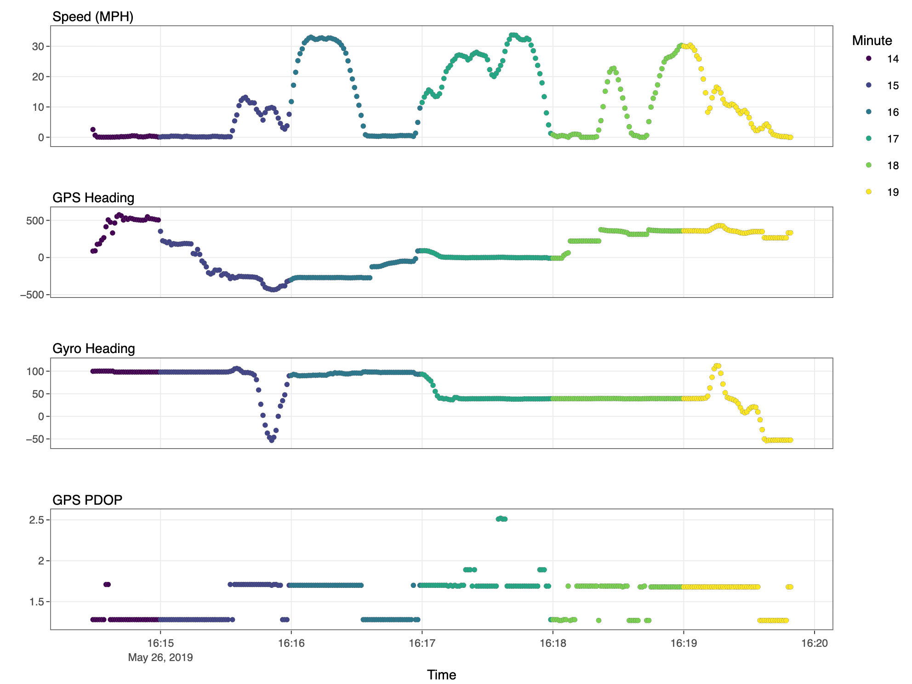
```

Figure `r knitr::asis_output(ifelse(knitr::is_html_output(), '\\@ref(fig:four-plots)', '\\@ref(fig:four-plots-screenshot)'))` gives a more detailed insight into the drive using a stack of four companion plots. The two middle plots show two different ways of measuring the heading, or the direction the vehicle is traveling. The second of the four plots shows the heading as measured by the GPS sensor mounted in the car while the third of the four plots shows the heading as measured by the gyroscope mounted in the car. The two sensors clearly measure heading differently, with the GPS heading being much less consistent than the gyro heading. Users of \pkg{DrivePlotR} can select the points where the GPS heading is particularly inconsistent and see if there are certain types of locations or driving scenarios where this behavior tends to occur.

# Use Cases 

## Assessing Data Quality

Figure \@ref(fig:headings) shows an overlay of the direction in which a car is moving during one drive, measured by (a) GPS (gray points) and (b) inferred from gyroscopic motion (colored points). The expectation would be that these two direction measures should be highly correlated. However, in this case, there are surprisingly large differences between the measurements. In particular, when the car is standing or moving very slowly, the GPS measurements show drastic (and most likely confabulated) changes in direction. The gray bands in Figure \@ref(fig:headings) indicate periods of speeds of less than 2 miles an hour. When the car is moving at more than that speed, the gyroscopic heading and GPS measurements move in tandem. Thus, for this example, the gyroscopic heading is generally more consistent and thus preferred over the GPS heading.

```{r headings, fig.cap="Comparison of two measures for a car's direction for one drive: colored points show gyroscopic heading (measured in the car), the gray points show heading as measured by GPS. When the speeds are low (gray rectangles), GPS heading shows dramatic changes."}
lowspeed_intervals <- nds_data7 |>
  mutate(
    low_speed = speed_mph < 1.75,
    diff_low_speed = low_speed - lag(low_speed)
  ) |>
  filter(diff_low_speed != 0 | is.na(diff_low_speed)) |>
  select(time_cst, low_speed, diff_low_speed) |>
  mutate(
    change = ifelse(low_speed, "toLow", "toHigh")
  ) |>
  ungroup() |>
  select(change, time_cst) |>
  mutate(id = 1:n()) |> # this line should not be necessary
  pivot_wider(names_from = change, values_from = time_cst)

lowspeed_intervals <- lowspeed_intervals |>
  select(-id) |>
  reframe(
    toHigh = na.omit(toHigh)[-1],
    toLow = na.omit(toLow)[-5]
  )

nds_data7 |>
  ggplot() +
  geom_hline(yintercept = c(0, 360, -360), colour = "grey60") +
  geom_point(aes(x = time_cst, y = gps_heading), colour = "grey50", size = 1) +
  geom_point(aes(x = time_cst, y = gyro_heading, colour = speed_mph)) +
  ylab("Headings") +
  theme_bw() +
  geom_rect(aes(xmin = toLow, xmax = toHigh, ymin = -Inf, ymax = +Inf), data = lowspeed_intervals, fill = "grey10", alpha = 0.25) +
  scale_y_continuous(breaks = 180 * (-2:5)) +
  scale_color_continuous("Speed (MPH)") +
  xlab("Time")
```

## Analytical/Diagnostic Use

### Turn Identification

\pkg{DrivePlotR} is a helpful tool for identifying different aspects of a drive. For example, an effective turn identification method is a necessary step in order to analyze the number of left and right turns or the time taken to complete individual turns. It is easy to distinguish turns visually, but it is not always straightforward to do so programmatically. Drifting GPS coordinates that do not exactly follow the road system make it difficult to identify turns using GPS data alone. If turns at a specific intersection are of interest, it may seem reasonable to examine drivers' behavior within the vicinity of the intersection. However, shifts in GPS data can cause the coordinates corresponding to the turns to deviate from the intersection proper, making geospatial turn identification unreliable. A better method of turn identification is needed.

\pkg{DrivePlotR} visualizations allow users to highlight turns on the map and then examine the speed and heading for the associated points on the companion graphs. Figure `r knitr::asis_output(ifelse(knitr::is_html_output(), '\\@ref(fig:leftturn)', '\\@ref(fig:leftturn-screenshot)'))` shows the whole drive, while \@ref(fig:leftturnzoom) focuses on the left turn. Although the GPS PDOP values are less than 5 (and therefore fall into the range of values considered good enough for most applications), Figure \@ref(fig:leftturnzoom) shows that the vehicle trajectory points within the intersection where the turn occurred deviate from the road system. Geospatial turn identification will be ineffective in scenarios like this. However, in addition to geospatial patterns, turns are also associated with a decrease in speed and a change in heading. These variables can be used to detect turns. 

```{r leftturn, fig.cap = "Identifying a left turn based on low speed and changes in heading.", include = knitr::is_html_output(), eval = knitr::is_html_output()}
# Data for left turn identification example
# nds_data16 <- nds_data |> filter(drive == 16)
# nds_data16 <- nds_data16 |>
#   mutate(time_cst = ymd_hms(time_cst, tz = "US/Central"),
#          gps_minute = as.factor(minute(time_cst)))

# nds_data16 <- nds_data16 |> mutate(
#   gps_heading_raw = gps_heading,
#   gps_heading_diff = angle_dist(gps_heading, lag(gps_heading,1)),
#   gps_heading_diff = ifelse(is.na(gps_heading_diff), gps_heading, gps_heading_diff),
#   gps_heading_diff_dampen = ifelse(between(gps_heading_diff,-20,20), gps_heading_diff, sign(gps_heading_diff)*20),
#   gps_heading = cumsum(gps_heading_diff),
#   gps_heading_corrected = cumsum(gps_heading_diff_dampen),
#   gyro_heading_raw = gyro_heading,
#   gyro_heading_diff = angle_dist(gyro_heading, lag(gyro_heading,1)),
#   gyro_heading_diff = ifelse(is.na(gyro_heading_diff), 0, gyro_heading_diff),
#   gyro_heading = cumsum(gyro_heading_diff),
#   speed_diff = speed_mph - lag(speed_mph, 1),
#   turn_aspect = factor(case_when(
#     between(time_cst, ymd_hms("2019-05-27 16:58:01", tz = "US/Central"), ymd_hms("2019-05-27 16:58:10", tz = "US/Central")) ~ "Approach",
#     between(time_cst, ymd_hms("2019-05-27 16:58:11", tz = "US/Central"), ymd_hms("2019-05-27 17:00:03", tz = "US/Central")) ~ "Waiting",
#                           between(time_cst, ymd_hms("2019-05-27 17:00:04", tz = "US/Central"), ymd_hms("2019-05-27 17:00:15", tz = "US/Central")) ~ "Turning", .default = "Unrelated"),
#                        levels = c("Approach", "Waiting", "Turning", "Unrelated"))
# )
#
# nds_sf16 <- nds_data16 |> sf::st_as_sf(coords = c("gps_long", "gps_lat"),
#                                 crs = "WGS84")
#
# nds_data16_sd <- crosstalk::SharedData$new(nds_data16)
# nds_sf16_sd <- crosstalk::SharedData$new(nds_sf16)
# left_turn_id <- driveplot(shareddata = nds_sf16_sd,
#                           x = time_cst,
#                           ys = c(speed_mph, gyro_heading, gyro_heading_diff, gps_pdop),
#                           colorvar = turn_aspect,
#                           maplabel = time_cst,
#                           colorpalette = "viridis",
#                           xlabel = "Time (CST)",
#                           ylabels = c("Speed (MPH)", "Gyro Heading",
#                                       "1 s Lagged Difference in Gyro Heading", "GPS PDOP"),
#                           legendtitle = "Left Turn Behavior")
# Saved manually as RJournal/figures/left_turn_id.html
knitr::include_url("figures/left_turn_id.html")
```

```{r leftturn-screenshot, fig.cap = "Identifying a left turn based on low speed and changes in heading. Visit the online version to see the interactive plot map.", include = knitr::is_latex_output(), eval = knitr::is_latex_output()}
# webshot2::webshot("figures/left_turn_id.html", "figures/left_turn_id.png", zoom = 2)
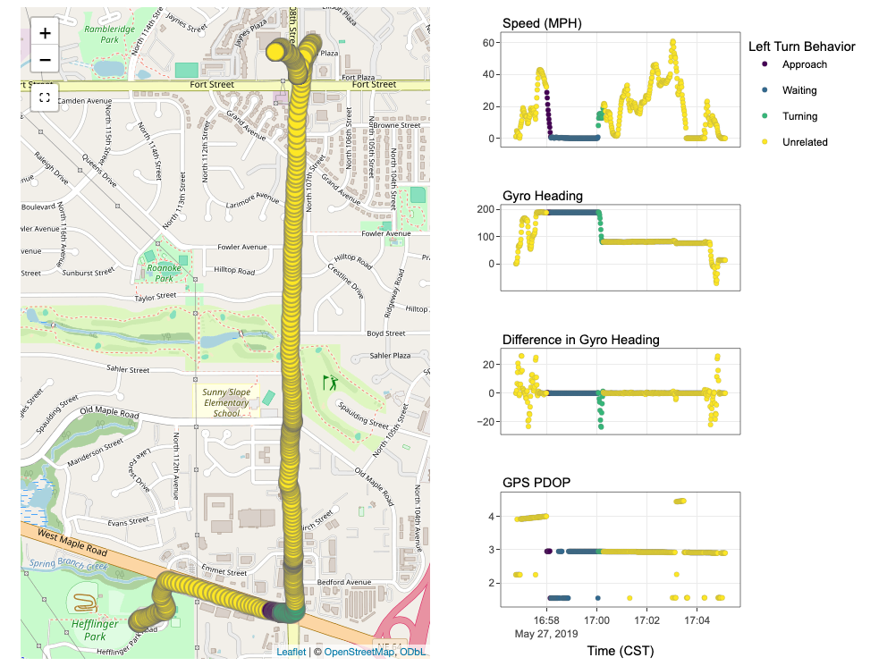
```

```{r leftturnzoom, fig.cap="Zooming in on the left turn."}
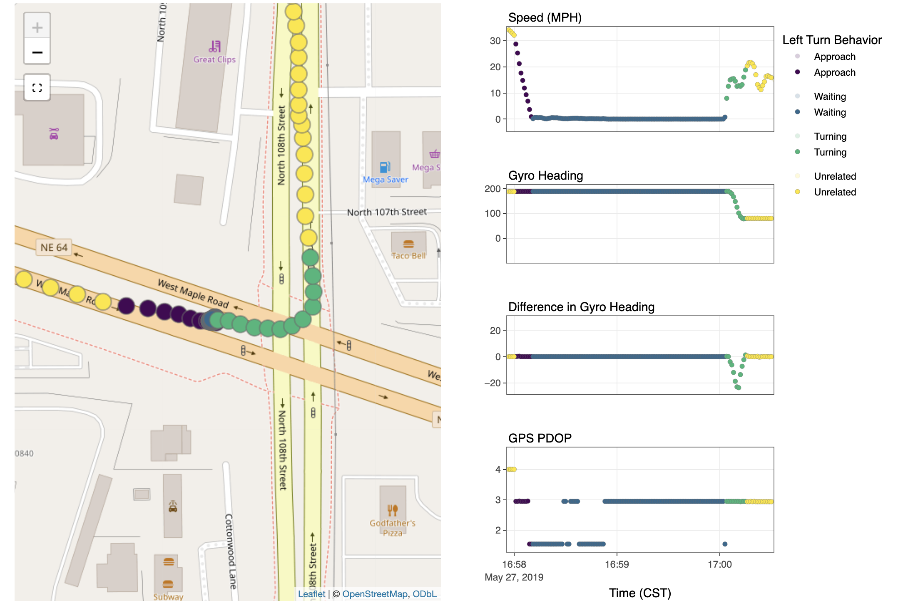
```

### Acceleration Event Investigation

Harsh acceleration and hard braking are undesirable driving behaviors that are known to be associated with unsafe driving conditions and otherwise avoidable vehicle wear-and-tear. In-vehicle accelerometers can monitor these events and flag when they occur. Detecting harsh acceleration and hard braking events may be of interest in the context of a naturalistic driving study. An example of part of an eastbound drive from an NDS that includes an acceleration event is shown in Figure \@ref(fig:accel). For this NDS, an acceleration event was defined as having occurred if the absolute longitudinal (front-to-back) or lateral (side-to-side) acceleration of the vehicle exceeded 0.35g for at least 0.1 second, where the unit "g" is the acceleration due to gravity (1g = 9.81 $\text{m/s}^2$). Three severity categories were defined based on the level of absolute acceleration: low for absolute accelerations of 0.35g to 0.44g, medium for absolute accelerations of 0.45g to 0.59g, and high for absolute accelerations over 0.6g. In Figure \@ref(fig:accel), the companion graphs show the speed of the vehicle in miles per hour, as well as the longitudinal acceleration and the lateral acceleration of the vehicle. Figure \@ref(fig:accel) shows a medium acceleration event detected due to a sharp decrease in longitudinal acceleration, although the GPS coordinates and the decrease in speed of approximately 1 mile per hour in 1 second associated with the acceleration event indicate that this acceleration event is likely not of concern. 

```{r accel, fig.cap="A likely unproblematic acceleration event detected during part of a drive from a naturalistic driving study, where the unit g in the companion graph labels is the acceleration due to gravity."}
#
# drive6 <- nds_data |> dplyr::filter(drive == 6)
# drive6 <- drive6 |>
#   sf::st_as_sf(coords = c("gps_long", "gps_lat"),
#                crs = "WGS84")
# drive6 <- drive6 |>
#   dplyr::mutate(time_cst = lubridate::ymd_hms(time_cst, tz = "US/Central"),
#                 gps_minute = as.factor(lubridate::minute(time_cst)),
#                  accel_event_cat_og = accel_event_cat,
#                 accel_event_cat = replace_na(accel_event_cat, "none"),
#                 accel_event_cat = factor(accel_event_cat, levels = c("none", "low", "med", "high")))
#
# drive6plot <- drive6 |>
#   filter(between(time_cst, ymd_hms("2019-05-26 15:52:54", tz = "US/Central"), ymd_hms("2019-05-26 15:54:17", tz = "US/Central")))
#
# shared_drive6plot <- crosstalk::SharedData$new(drive6plot)
# #
# accel_events <- driveplot(
#   shareddata = shared_drive6plot,
#   x = time_cst,
#   ys = c(speed_mph, accel_x, accel_y),
#   colorvar = accel_event_cat,
#   maplabel = glue::glue("{time_cst}; {accel_event_cat}"),
#   colorpalette = "viridis",
#   fillopacity = 0.75,
#   xlabel = "Time",
#   ylabels = c("Speed (MPH)", "Longitudinal Acceleration (g)", "Lateral Acceleration (g)"),
#   showlegend = TRUE,
#   legendtitle = "Type of Acceleration Event",
#   spacing = 0.05)
# Saved manually as acceleration_events_none.html
# Took screenshot of plot zoomed in on the medium acceleration event
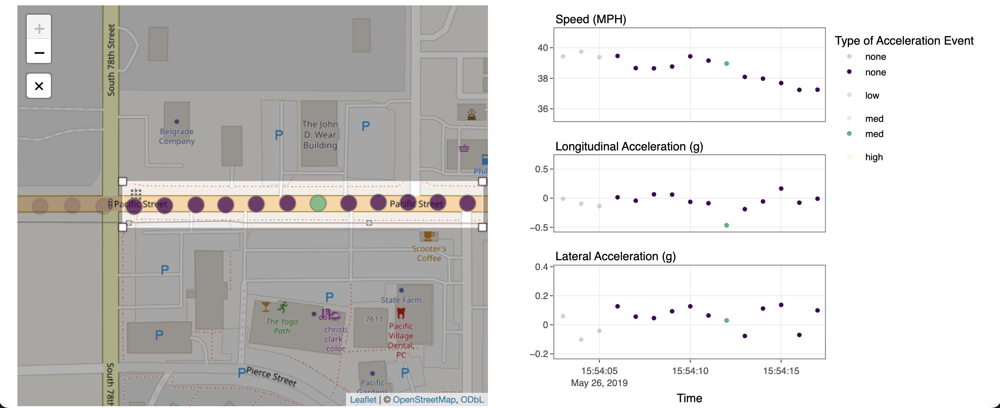
```

Figure \@ref(fig:rightturn) shows a low acceleration event detected during a different drive from the same NDS. This acceleration event was detected due to an increase in lateral acceleration above 0.35g. Although the recorded GPS points drifted away from the road system in this case, it is reasonable to assume that the sharp angle of the intersection between the two streets forced the driver to make a sharp turn that showed up in the lateral acceleration data as a rapid increase above the threshold for acceleration event detection. Figure \@ref(fig:accel) and Figure \@ref(fig:rightturn) show that \pkg{DrivePlotR} visualizations can help identify whether detected acceleration events in vehicle trajectory data are problematic. Such insights can inform refinements of the thresholds used to detect and classify acceleration events. 

```{r rightturn, fig.cap="A lateral acceleration event detected before a sharp right turn."}
# drive_right <- nds_data |> dplyr::filter(drive == 7)
# drive_right <- drive_right |>
#   sf::st_as_sf(coords = c("gps_long", "gps_lat"),
#                crs = "WGS84")
# drive_right <- drive_right |>
#   dplyr::mutate(time_cst = lubridate::ymd_hms(time_cst, tz = "US/Central"),
#                 gps_minute = as.factor(lubridate::minute(time_cst)),
#                 accel_event_cat_og = accel_event_cat,
#                 accel_event_cat = tidyr::replace_na(accel_event_cat, "none"),
#                 accel_event_cat = factor(accel_event_cat, levels = c("none", "low")))
#
# shared_drive_right <-
#   crosstalk::SharedData$new(drive_right)

# right_turn <- driveplot(
#   shareddata = shared_drive_right,
#   maplabel = time_cst, colorvar = accel_event_cat,
#   colorpalette = "viridis", fillopacity = 0.75,
#   x = time_cst,
#   ys = c(speed_mph, accel_y),
#   xlabel = "Time",
#   ylabels = c("Speed (MPH)", "Lateral Acceleration (g)"),
#   showlegend = TRUE,
#   legendtitle = "Type of Acceleration Event",
#   spacing = 0.05)
# Saved manually as figures/accel_event_right_turn_none.html
# Zoomed in screenshot in RJournal/figures/accel_event_right_turn_none.png
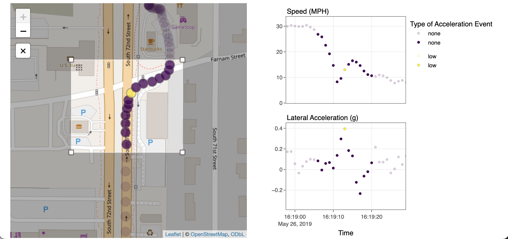
```

# DrivePlotR Workflow 

This section outlines the basic workflow for making visualizations with \pkg{DrivePlotR}. The package contains four main functions, each of which are used when creating an interactive plot map. The main functions are

* `driveplot()` (the primary function; creates an interactive plot map by calling `driveplot_map()` and `driveplot_companions()`)

* `driveplot_map()` (creates an interactive map)

* `driveplot_companions()` (creates multiple stacked companion graphs by calling `driveplot_companion()`)

* `driveplot_companion()` (creates a single companion graph)

The relationship between the main \pkg{DrivePlotR} functions is shown in Figure \@ref(fig:functions). \pkg{DrivePlotR} also contains several internal helper functions that are not user-facing.

```{r functions, fig.cap="The relationship between the four main DrivePlotR functions. The function driveplot calls both driveplot\\_map and driveplot\\_companions.  The function driveplot\\_companions calls driveplot\\_companion to create each companion graph for the stack."}
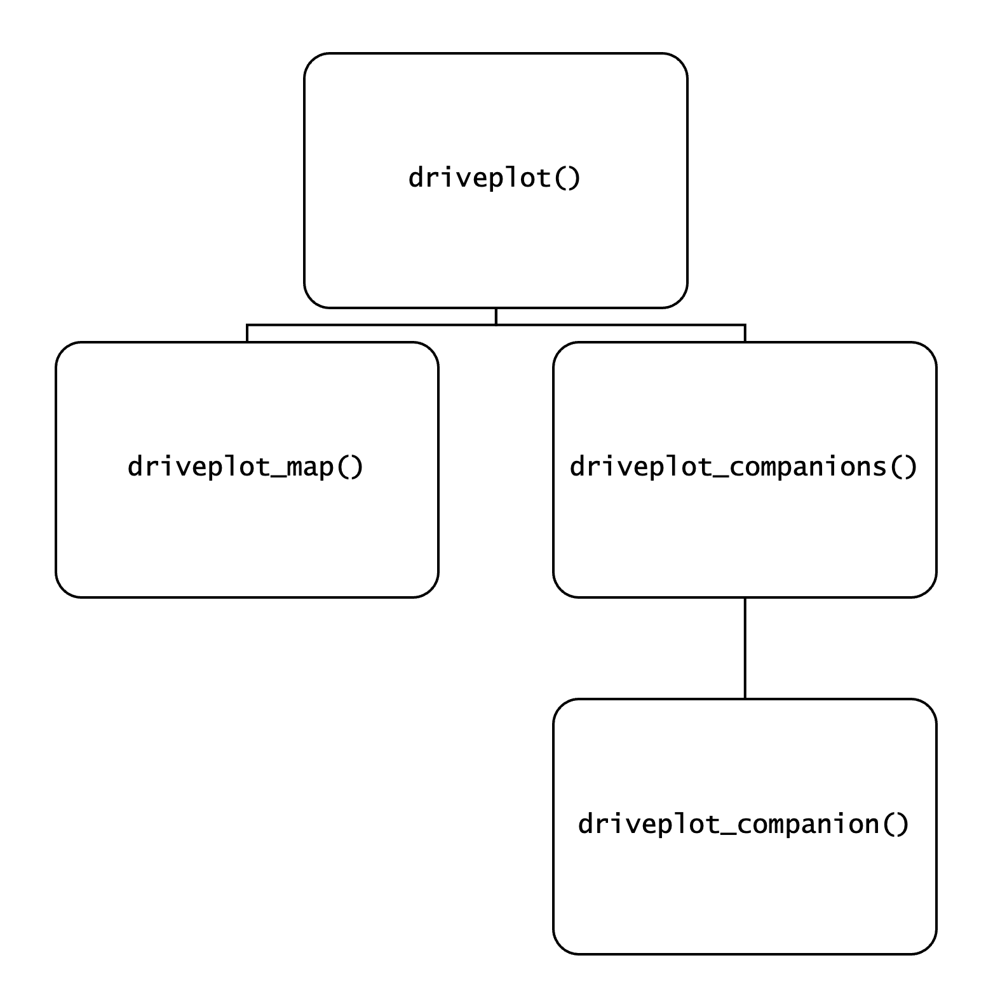
```

Now, we describe the steps in a basic workflow for \pkg{DrivePlotR}.

i. Make the drive data available in the R session. Non-sensitive drives from a naturalistic driving study have been made available as part of the \pkg{DrivePlotR} package, but any other data with both geographic and temporal components would also be suitable. Recall that \pkg{DrivePlotR} expects one row for each observation in the data.

```{r loaddata, echo=TRUE}
library(DrivePlotR)
data("drive7")
```

ii. Establish the geographic variables and projection. Setting the coordinate reference system (CRS) to WGS84 is necessary to ensure that points are compatible with maps in Leaflet. This CRS is already set for the example dataset `drive7` included with \pkg{DrivePlotR}. The latitude and longitude coordinates in the example dataset `nds_data` included with \pkg{DrivePlotR} also already use the WGS84 CRS. Users may find that using functions from \CRANpkg{sf} makes it easier to set the CRS for their data, but \CRANpkg{sf} is not required to use \pkg{DrivePlotR}. 

iii. Convert the data into a shared data frame using \CRANpkg{crosstalk}. (If the user does not pass a shared data frame into a \pkg{DrivePlotR} function, the conversion will happen as part of the function call and the function will warn the user.)

```{r shareddata, echo=TRUE}
shared_drive <- crosstalk::SharedData$new(drive7)
```

iv. Create plot maps with \pkg{DrivePlotR}.

Although the main purpose of \pkg{DrivePlotR} is for users to create linked visualizations with a map and one to four companion graphs, users can also create maps or companion graphs separately. A basic standalone map, such as the one in Figure `r knitr::asis_output(ifelse(knitr::is_html_output(), '\\@ref(fig:basic-map)', '\\@ref(fig:basic-map-screenshot)'))`, can be created as follows:

```{r mapcode, echo=TRUE, eval=FALSE}
driveplot_map(shareddata = shared_drive)
```

```{r basic-map, fig.cap="A basic standalone map.", include = knitr::is_html_output(), eval = knitr::is_html_output()}
# Saved manually as RJournal/figures/basic_map.html
knitr::include_url("figures/basic_map.html")
```

```{r basic-map-screenshot, fig.cap="A basic standalone map. Visit the online version to see the interactive map.", include = knitr::is_latex_output(), eval = knitr::is_latex_output()}
# webshot2::webshot(here::here("RJournal/figures/basic_map.html"),
#                   here::here("RJournal/figures/basic_map.png"),
#                   delay = 10,
#                   zoom = 2)
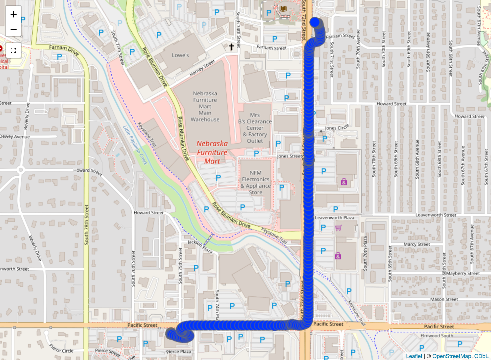
```

Users may also create standalone companion graphs. The basic companion graph created by the code below is shown in Figure `r knitr::asis_output(ifelse(knitr::is_html_output(), '\\@ref(fig:basic-graph)', '\\@ref(fig:basic-graph-screenshot)'))`.

```{r basic-graph-code, echo=TRUE, eval=FALSE}
driveplot_companion(
  shareddata = shared_drive,
  x = time_cst,
  y = speed_mph,
  xlabel = "Time",
  ylabel = "Speed (MPH)"
)
```

```{r basic-graph, fig.cap="A basic companion graph for speed.", include = knitr::is_html_output(), eval = knitr::is_html_output()}
# saved manually as figures/basic_graph.html
knitr::include_url("figures/basic_graph.html")
```

```{r basic-graph-screenshot, fig.cap="A basic companion graph for speed. Visit the online version to see the interactive companion graph.", include = knitr::is_latex_output(), eval = knitr::is_latex_output()}
# webshot2::webshot(here::here("RJournal/figures/basic_graph.html"),
#                   here::here("RJournal/figures/basic_graph.png"),
#                   delay = 10,
#                   zoom = 2)
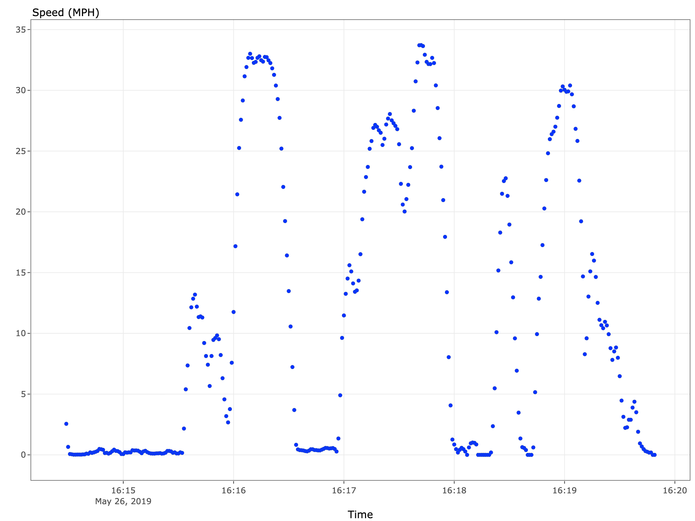
```

Users can perform transformations within \pkg{DrivePlotR} function arguments. Suppose the user wants to recreate the visualization in Figure `r knitr::asis_output(ifelse(knitr::is_html_output(), '\\@ref(fig:basic-graph)', '\\@ref(fig:basic-graph-screenshot)'))`, but with time in UTC instead of US/Central time and speed in kilometers per hour instead of miles per hour. These transformations can be made within the `driveplot_companion` function arguments. Similar transformations can be made to the `x` and `ys` arguments of `driveplot_companions()`and `driveplot()` as well.

```{r transform-graph-code, echo = TRUE, eval = FALSE}
driveplot_companion(
  shareddata = shared_drive,
  x = as.POSIXct(time_cst, tz = "UTC"),
  y = speed_mph * 1.609,
  xlabel = "Time (UTC)",
  ylabel = "Speed (KPH)"
)
```

```{r transform-graph, fig.cap="A companion graph where time and speed have been transformed within the function arguments.", include = knitr::is_html_output(), eval = knitr::is_html_output()}
# Saved manually as RJournal/figures/transform_graph.html
knitr::include_url("figures/transform_graph.html")
```

```{r transform-graph-screenshot, fig.cap="A basic companion graph where time and speed have been transformed within the function arguments. Visit the online version to see the interactive companion graph.", include = knitr::is_latex_output(), eval = knitr::is_latex_output()}
# webshot2::webshot(here::here("RJournal/figures/transform_graph.html"),
#                   here::here("RJournal/figures/transform_graph.png"),
#                   delay = 10,
#                   zoom = 2)
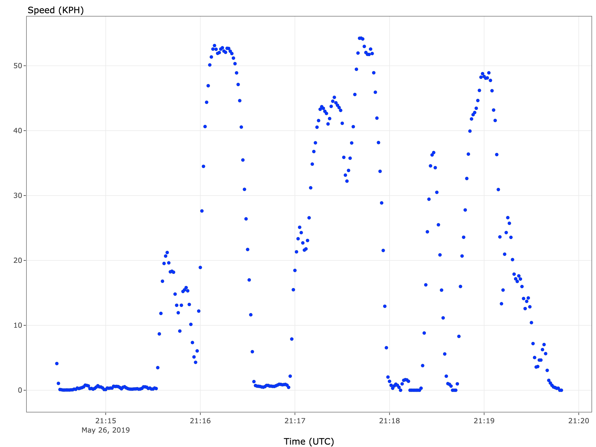
```

\pkg{DrivePlotR} offers many options to customize a plot map. For example, the following code was used to create the plot map in Figure \@ref(fig:teaser).

```{r teaser-code, echo=TRUE, eval=FALSE}
driveplot(
  shareddata = shared_drive,
  x = time_cst,
  ys = c(speed_mph, gyro_heading, gps_pdop),
  colorvar = gps_minute, maplabel = time_cst,
  colorpalette = "viridis",
  xlabel = "Time",
  ylabels = c("Speed (MPH)", "Gyro Heading", "GPS PDOP"),
  showlegend = TRUE,
  legendtitle = "Minute",
  plottitle = "A Drive in Omaha, NE"
)
```

As mentioned previously, users can transform arguments to \pkg{DrivePlotR} functions when they are specified. In the example in Figure `r knitr::asis_output(ifelse(knitr::is_html_output(), '\\@ref(fig:transform-plotmap)', '\\@ref(fig:transform-plotmap-screenshot)'))`, speed in miles per hour (MPH) is converted to kilometers per hour (KPH), while gyro heading numbers are translated into general directions (N, S, E, W). 

```{r transform-plotmap-code, echo=TRUE, eval=FALSE}
driveplot(
  shareddata = shared_drive,
  x = time_cst,
  ys = c(
    speed_mph * 1.60934,
    c("N", "E", "S", "W")[findInterval(
      (gyro_heading + 45) %% 360,
      c(90, 180, 270)
    ) + 1],
    gps_pdop
  ),
  colorvar = gps_minute,
  maplabel = time_cst,
  colorpalette = "viridis",
  xlabel = "Time",
  ylabels = c("Speed (KPH)", "General Gyro Heading", "GPS PDOP"),
  showlegend = TRUE,
  legendtitle = "Minute",
  plottitle = "A Drive in Omaha, NE"
)
```
```{r transform-plotmap, fig.cap="A plot map where speed in miles per hour has been converted to kilometers per hour and gyro heading numbers have been converted to general heading directions (N, S, E, W) within the function call.", include = knitr::is_html_output(), eval = knitr::is_html_output()}
# driveplot(
#   shareddata = shared_drive,
#   x = time_cst,
#   ys = c(
#     speed_mph * 1.60934,
#     c("N", "E", "S", "W")[findInterval(
#       (gyro_heading + 45) %% 360,
#       c(90, 180, 270)
#     ) + 1],
#     gps_pdop
#   ),
#   colorvar = gps_minute,
#   maplabel = time_cst,
#   colorpalette = "viridis",
#   xlabel = "Time",
#   ylabels = c("Speed (KPH)", "General Gyro Heading", "GPS PDOP"),
#   showlegend = TRUE,
#   legendtitle = "Minute",
#   plottitle = "A Drive in Omaha, NE"
# )
# Saved manually as RJournal/figures/transform_plotmap.html using RStudio Viewer Export
# webshot2::webshot(here::here("RJournal/figures/transform_plotmap.html"),
#                   file = here::here("RJournal/figures/transform_plotmap.png"),
#                   delay = 1,
#                   zoom = 2)

knitr::include_url("figures/transform_plotmap.html")
```

```{r transform-plotmap-screenshot, fig.cap="A plot map where speed in miles per hour has been converted to kilometers per hour and gyro heading numbers have been converted to general heading directions (N, S, E, W) within the function call. Visit the online version to see the interactive plot map.", include = knitr::is_latex_output(), eval = knitr::is_latex_output()}
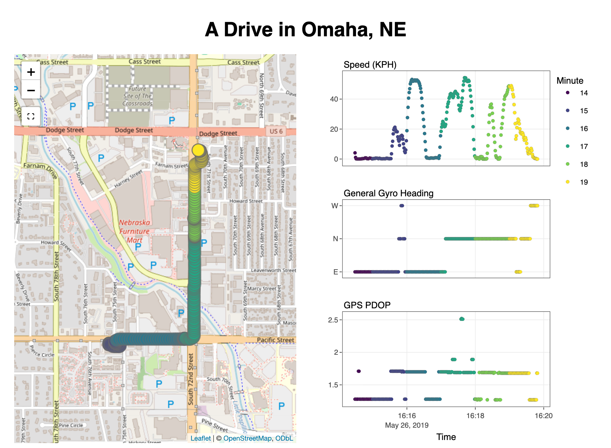
```

v. Save and share interactive plot maps.

\pkg{DrivePlotR} plot maps can be saved by including them in an RMarkdown document knitted to a self-contained HTML file or a Quarto document rendered to HTML with embedded resources. Another option is to manually save the \pkg{DrivePlotR} visualization as a web page from the RStudio Viewer pane.

# Extensions/Limitations 

One current limitation of \pkg{DrivePlotR} is that color and position are the only possible ways to distinguish data points from each other. This means that it becomes difficult to differentiate more than a handful of distinct drives on the same plot map. In future extensions of \pkg{DrivePlotR}, it would be beneficial to include the option to change the shape of the points based on user preference or a variable in the dataset. This will enable \pkg{DrivePlotR} to better handle use cases where users need to differentiate multiple drives by the same driver or drives made by different drivers. 

The ideas behind \pkg{DrivePlotR} visualizations are also applicable to other data sources. Similar visualizations as for NDS and CV data can be created for micromobility data from bicycles or scooters. For a precision agriculture application, \pkg{DrivePlotR} can create an interactive visualization of the GPS location and seeding rate for a tractor as it is driven through a field to plant this year's corn crop. \pkg{DrivePlotR} can also help analyze the paths and product application rates (e.g., salt) of snowplows as they clear roads during a blizzard. These are only a few of the possibilities for \pkg{DrivePlotR} visualizations.

